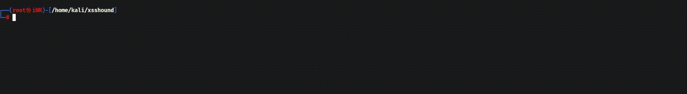

# XSSHound 🐺  
Advanced Reflected XSS Detection Tool

XSSHound is a lightweight but powerful reflected XSS scanner designed for security researchers and penetration testers.  
The tool focuses on **accurate reflected XSS detection**.

XSSHound automatically:
- Injects payloads from a user-supplied list  
- Identifies exact reflection locations  
- Works with GET and POST  
- Supports authenticated scanning (cookies)

---

## Usage
```bash
python xsshound.py -u <url> -f <parameter> -p <payload_file> -c <cookie> [-m get|post]
```
## Example 
